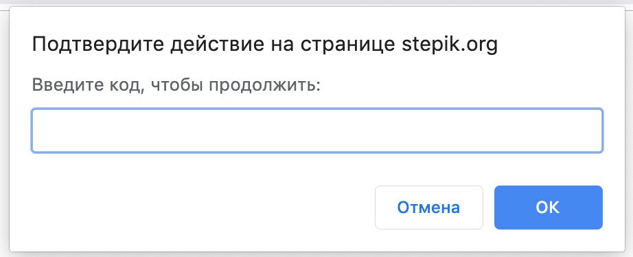

### Alerts и как с ними жить

Мы уже встречали alert в нашем курсе, когда получали число-ответ в задачах. Также мы узнали, что можно самостоятельно вызвать alert с помощью JavaScript:

```alert('Hello!');```


Теперь рассмотрим ситуацию, когда в сценарии теста возникает необходимость не только получить содержимое alert, но и нажать кнопку OK, чтобы закрыть alert. **Alert** является модальным окном: это означает, что пользователь не может взаимодействовать дальше с интерфейсом, пока не закроет alert. Для этого нужно сначала переключиться на окно с alert, а затем принять его с помощью команды **accept()**:

```
alert = browser.switch_to.alert
alert.accept()
```
Чтобы получить текст из alert, используйте свойство text объекта alert:

```
alert = browser.switch_to.alert
alert_text = alert.text
```
Другой вариант модального окна, который предлагает пользователю выбор согласиться с сообщением или отказаться от него, называется confirm. Для переключения на окно confirm используется та же команда, что и в случае с alert:
```
confirm = browser.switch_to.alert
confirm.accept()
```


Для confirm-окон можно использовать следующий метод для отказа:

```confirm.dismiss()```

То же самое, что и при нажатии пользователем кнопки "Отмена".

Третий вариант модального окна — **prompt** — имеет дополнительное поле для ввода текста. Чтобы ввести текст, используйте метод **send_keys()**:
```
prompt = browser.switch_to.alert
prompt.send_keys("My answer")
prompt.accept()
```

