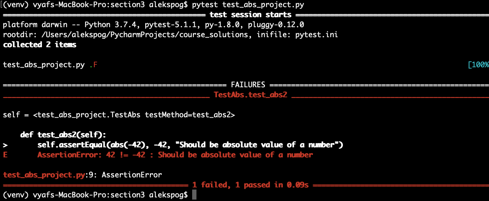
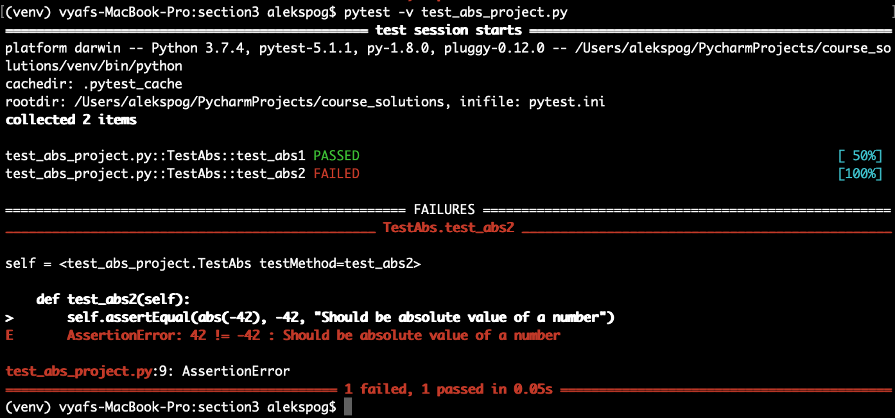

### PyTest — отчёты
Вы могли заметить, что PyTest позволяет генерировать подробный отчёт с поддержкой цветовых схем и форматированием прямо из коробки.

Давайте еще раз запустим наши тесты с помощью unittest и PyTest, чтобы сравнить выводимый результат.

Мы видим, что в PyTest-отчёте упавший тест выделен красным шрифтом, что делает разбор логов более приятным занятием.

**unittest:**


**PyTest:** 



Если запустить PyTest с параметром **-v** (**verbose**, то есть подробный), то в отчёт добавится дополнительная информация со списком тестов и статусом их прохождения: 



Другие полезные команды для манипуляции выводом тестов PyTest можно найти по ссылке: Useful py.test commands.

### PyTest — как пишут тесты
PyTest не требует написания дополнительных специфических конструкций в тестах, как того требует unittest.

Мы уже увидели, что PyTest может запускать тесты, написанные в unittest-стиле. Перепишем наши тесты из **test_abs_project.py** в более простом формате, который также понимает PyTest. Назовём новый файл test_abs.py:
```python
def test_abs1():
    assert abs(-42) == 42, "Should be absolute value of a number"

def test_abs2():
    assert abs(-42) == -42, "Should be absolute value of a number"
```
Запустим тесты в этом файле:

```
pytest test_abs.py
```
Код тестов стал короче и читабельнее.


### PyTest — проверка ожидаемого результата (assert)
Если вы используете unittest, то для проверки ожидаемых результатов в тестах вам нужно знать и использовать большой набор assert-методов, например, таких: assertEqual, assertNotEqual, assertTrue, assertFalse и другие.

В PyTest используется стандартный assert метод из языка Python, что делает код более очевидным.

Давайте сравним два подхода. Проверим, что две переменные равны друг другу.

####unittest:

```python
self.assertEqual(a, b, msg="Значения разные")
```
PyTest:

```python
assert a == b, "Значения разные"
```
С помощью assert можно проверять любую конструкцию, которая возвращает True/False. Это может быть проверка равенства, неравенства, содержания подстроки в строке или любая другая вспомогательная функция, которую вы опишете самостоятельно. Все это делает код проверок приятным и понятным для чтения: 

```python
assert user_is_authorised(), "User is guest"
```
Если нужно проверить, что тест вызывает ожидаемое исключение (довольно редкая ситуация для UI-тестов, и вам этот способ, скорее всего, никогда не пригодится), мы можем использовать специальную конструкцию ```with pytest.raises()```. Например, можно проверить, что на странице сайта не должен отображаться какой-то элемент:

```python
import pytest

from selenium import webdriver
from selenium.common.exceptions import NoSuchElementException


def test_exception1():
    try:
        browser = webdriver.Chrome()
        browser.get("http://selenium1py.pythonanywhere.com/")
        with pytest.raises(NoSuchElementException):
            browser.find_element_by_css_selector("button.btn")
            pytest.fail("Не должно быть кнопки Отправить")
    finally: 
        browser.quit()

def test_exception2():
    try:
        browser = webdriver.Chrome()
        browser.get("http://selenium1py.pythonanywhere.com/")
        with pytest.raises(NoSuchElementException):
            browser.find_element_by_css_selector("no_such_button.btn")
            pytest.fail("Не должно быть кнопки Отправить")
    finally: 
        browser.quit()
```
В первом тесте элемент будет найден, поэтому ошибка **NoSuchElementException**, которую ожидает контекстный менеджер pytest.raises, не возникнет, и тест упадёт.

```
test_3_3_9_pytest_raises.py:8 (test_exception1)
E   Failed: Не должно быть кнопки Отправить
```
Во втором тесте, как мы и ожидали, кнопка не будет найдена, и тест пройдет. 