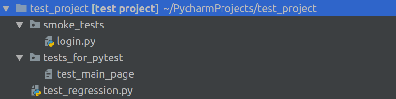

### Задание: запуск тестов
Соискатель прислал тестовый проект в качестве тестового задания на вакансию в вашу компанию: 



Содержимое самих файлов выглядит примерно так: 

#### tests_for_pytest/test_main_page: 

```python
# номер 1
def main_page_buttons(browser):

# номер 2
def test_main_page_navbar(browser):
```
#### smoke_tests/login.py:

```python
# номер 3
def test_guest_can_login(browser, language):

# номер 4
class TestLogin(object):
    def test_guest_should_see_login_link(self, browser, language):
```
#### (корневая директория проекта) test_regression.py:

```python
class TestLessonCreate():
    # номер 5
    def test_create_lesson(self, browser):

    # номер 6
    def user_with_lesson_can_create_lesson_from_navbar_test(self, browser):


class CourseCreate():
    # номер 7
    def test_create_course(self, browser):

# номер 8
def test_guest_can_open_new_course(browser):
```
Вы пытаетесь запустить тесты из директории, в которой содержится проект test_project, с помощью PyTest командой: 

```
pytest test_project
```
Отметьте ниже только те тестовые методы, которые будут найдены и выполнены PyTest:

- [ ] номер 1
- [ ] номер 2
- [ ] номер 3
- [ ] номер 4
- [X] номер 5
- [ ] номер 6
- [ ] номер 7
- [X] номер 8