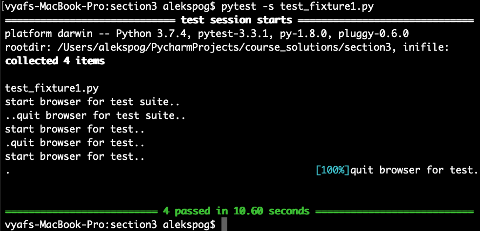
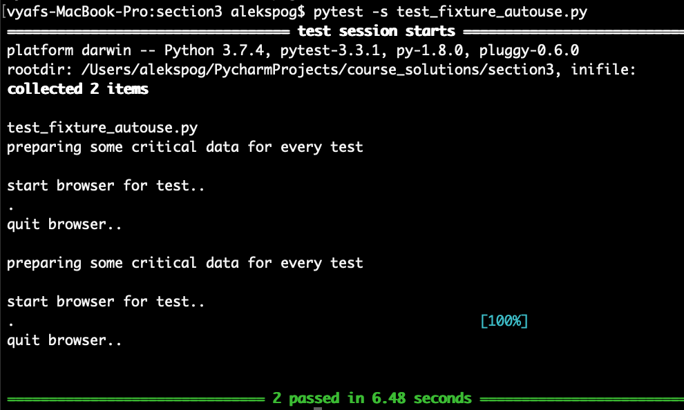

### Классические фикстуры (fixtures)
Важной составляющей в использовании PyTest является концепция фикстур. Фикстуры в контексте PyTest — это вспомогательные функции для наших тестов, которые не являются частью тестового сценария.

Назначение фикстур может быть самым разным. Одно из распространенных применений фикстур — это подготовка тестового окружения и очистка тестового окружения и данных после завершения теста. Но, вообще говоря, фикстуры можно использовать для самых разных целей: для подключения к базе данных, с которой работают тесты, создания тестовых файлов или подготовки данных в текущем окружении с помощью API-методов. Более подробно про фикстуры в широком смысле вы можете прочитать в Википедии.

Классический способ работы с фикстурами — создание setup- и teardown-методов в файле с тестами (документация в PyTest).

Можно создавать фикстуры для модулей, классов и отдельных функций. Давайте попробуем написать фикстуру для инициализации браузера, который мы затем сможем использовать в наших тестах. После окончания тестов мы будем автоматически закрывать браузер с помощью команды **browser.quit()**, чтобы в нашей системе не оказалось множество открытых окон браузера. Вынесем инициализацию и закрытие браузера в фикстуры, чтобы не писать этот код для каждого теста.

Будем сразу объединять наши тесты в тест-сьюты, роль тест-сьюта будут играть классы, в которых мы будем хранить наши тесты.

Рассмотрим два примера: создание экземпляра браузера и его закрытие только один раз для всех тестов первого тест-сьюта и создание браузера для каждого теста во втором тест-сьюте. Сохраните следующий код в файл **test_fixture1.py**  и запустите его с помощью PyTest. Не забудьте указать параметр **-s**, чтобы увидеть текст, который выводится командой print().

```
pytest -s test_fixture1.py
```
**test_fixture1.py:**
```python
from selenium import webdriver

link = "http://selenium1py.pythonanywhere.com/"


class TestMainPage1():

    @classmethod
    def setup_class(self):
        print("\nstart browser for test suite..")
        self.browser = webdriver.Chrome()

    @classmethod
    def teardown_class(self):
        print("quit browser for test suite..")
        self.browser.quit()

    def test_guest_should_see_login_link(self):
        self.browser.get(link)
        self.browser.find_element_by_css_selector("#login_link")

    def test_guest_should_see_basket_link_on_the_main_page(self):
        self.browser.get(link)
        self.browser.find_element_by_css_selector(".basket-mini .btn-group > a")


class TestMainPage2():

    def setup_method(self):
        print("start browser for test..")
        self.browser = webdriver.Chrome()

    def teardown_method(self):
        print("quit browser for test..")
        self.browser.quit()

    def test_guest_should_see_login_link(self):
        self.browser.get(link)
        self.browser.find_element_by_css_selector("#login_link")

    def test_guest_should_see_basket_link_on_the_main_page(self):
        self.browser.get(link)
        self.browser.find_element_by_css_selector(".basket-mini .btn-group > a")


```
В консоли видим 



Мы видим, что в первом тест-сьюте браузер запустился один раз, а во втором — два раза.

Данные и кэш, оставшиеся от запуска предыдущего теста, могут влиять на результаты выполнения следующего теста, поэтому лучше всего запускать отдельный браузер для каждого теста, чтобы тесты были стабильнее. К тому же если вдруг браузер зависнет в одном тесте, то другие тесты не пострадают, если они запускаются каждый в собственном браузере.

Минусы запуска браузера на каждый тест: каждый запуск и закрытие браузера занимают время, поэтому тесты будут идти дольше. Возможно, вы захотите оптимизировать время прогона тестов, но лучше это делать с помощью других инструментов, которые мы разберём в дальнейшем.

Обычно такие фикстуры переезжают вместе с тестами, написанными с помощью unittest, и приходится их поддерживать, но сейчас все пишут более гибкие фикстуры **@pytest.fixture**, которые мы рассмотрим в следующем шаге. 


### Фикстуры, возвращающие значение
Мы рассмотрели базовый подход к созданию фикстур, когда тестовые данные задаются и очищаются в setup и teardown методах. PyTest предлагает продвинутый подход к фикстурам, когда фикстуры можно задавать глобально, передавать их в тестовые методы как параметры, а также имеет набор встроенных фикстур. Это более гибкий и удобный способ работы со вспомогательными функциями, и сейчас вы сами увидите почему. 

#### Возвращаемое значение

Фикстуры могут возвращать значение, которое затем можно использовать в тестах. Давайте перепишем наш предыдущий пример с использованием PyTest фикстур. Мы создадим фикстуру **browser**, которая будет создавать объект WebDriver. Этот объект мы сможем использовать в тестах для взаимодействия с браузером. Для этого мы напишем метод browser и укажем, что он является фикстурой с помощью декоратора **@pytest.fixture**. После этого мы можем вызывать фикстуру в тестах, передав ее как параметр. По умолчанию фикстура будет создаваться для каждого тестового метода, то есть для каждого теста запустится свой экземпляр браузера.

```
pytest -s -v test_fixture2.py
```
**test_fixture2.py:**
```python
import pytest
from selenium import webdriver

link = "http://selenium1py.pythonanywhere.com/"


@pytest.fixture
def browser():
    print("\nstart browser for test..")
    browser = webdriver.Chrome()
    return browser


class TestMainPage1():
    # вызываем фикстуру в тесте, передав ее как параметр
    def test_guest_should_see_login_link(self, browser):
        browser.get(link)
        browser.find_element_by_css_selector("#login_link")

    def test_guest_should_see_basket_link_on_the_main_page(self, browser):
        browser.get(link)
        browser.find_element_by_css_selector(".basket-mini .btn-group > a")
```


### Финализаторы — закрываем браузер
Вероятно, вы заметили, что мы не использовали в этом примере команду **browser.quit()**. Это привело к тому, что несколько окон браузера оставались открыты после окончания тестов, а закрылись только после завершения всех тестов. Закрытие браузеров произошло благодаря встроенной фикстуре — сборщику мусора. Но если бы количество тестов насчитывало больше нескольких десятков, то открытые окна браузеров могли привести к тому, что оперативная память закончилась бы очень быстро. Поэтому надо явно закрывать браузеры после каждого теста. Для этого мы можем воспользоваться **финализаторами**. Один из вариантов финализатора — использование ключевого слова Python: **yield**. После завершения теста, который вызывал фикстуру, выполнение фикстуры продолжится со строки, следующей за строкой со словом **yield**:

**test_fixture3.py**

```python
import pytest
from selenium import webdriver

link = "http://selenium1py.pythonanywhere.com/"


@pytest.fixture
def browser():
    print("\nstart browser for test..")
    browser = webdriver.Chrome()
    yield browser
    # этот код выполнится после завершения теста
    print("\nquit browser..")
    browser.quit()


class TestMainPage1():
    # вызываем фикстуру в тесте, передав ее как параметр
    def test_guest_should_see_login_link(self, browser):
        browser.get(link)
        browser.find_element_by_css_selector("#login_link")

    def test_guest_should_see_basket_link_on_the_main_page(self, browser):
        browser.get(link)
        browser.find_element_by_css_selector(".basket-mini .btn-group > a")
```
Есть альтернативный способ вызова teardown кода с помощью встроенной фикстуры **request** и ее метода **addfinalizer**. Можете изучить его сами по документации [PyTest][1].

[1]: https://docs.pytest.org/en/latest/how-to/fixtures.html#adding-finalizers-directly

Рекомендуем также выносить очистку данных и памяти в фикстуру, вместо того чтобы писать это в шагах теста: финализатор выполнится даже в ситуации, когда тест упал с ошибкой. 


### Область видимости scope
Для фикстур можно задавать область покрытия фикстур. Допустимые значения: “**function**”, “**class**”, “**module**”, “**session**”. Соответственно, фикстура будет вызываться один раз для тестового метода, один раз для класса, один раз для модуля или один раз для всех тестов, запущенных в данной сессии. 

Запустим все наши тесты из класса **TestMainPage1** в одном браузере для экономии времени, задав scope="class" в фикстуре browser:

**test_fixture5.py**

```python
import pytest
from selenium import webdriver

link = "http://selenium1py.pythonanywhere.com/"


@pytest.fixture(scope="class")
def browser():
    print("\nstart browser for test..")
    browser = webdriver.Chrome()
    yield browser
    print("\nquit browser..")
    browser.quit()


class TestMainPage1():

    # вызываем фикстуру в тесте, передав ее как параметр
    def test_guest_should_see_login_link(self, browser):
        print("start test1")
        browser.get(link)
        browser.find_element_by_css_selector("#login_link")
        print("finish test1")

    def test_guest_should_see_basket_link_on_the_main_page(self, browser):
        print("start test2")
        browser.get(link)
        browser.find_element_by_css_selector(".basket-mini .btn-group > a")
        print("finish test2")
```
Мы видим, что в данном примере браузер открылся один раз и тесты последовательно выполнились в этом браузере. Здесь мы проделали это в качестве примера, но мы крайне рекомендуем всё же запускать отдельный экземпляр браузера для каждого теста, чтобы повысить стабильность тестов. Фикстуры, которые занимают много времени для запуска и ресурсов (обычно это работа с базами данных), можно вызывать и один раз за сессию запуска тестов.


### Автоиспользование фикстур
При описании фикстуры можно указать дополнительный параметр **autouse=True**, который укажет, что фикстуру нужно запустить для каждого теста даже без явного вызова: 

**test_fixture_autouse.py**

```python
import pytest
from selenium import webdriver

link = "http://selenium1py.pythonanywhere.com/"


@pytest.fixture
def browser():
    print("\nstart browser for test..")
    browser = webdriver.Chrome()
    yield browser
    print("\nquit browser..")
    browser.quit()

@pytest.fixture(autouse=True)
def prepare_data():
    print()
    print("preparing some critical data for every test")


class TestMainPage1():
    def test_guest_should_see_login_link(self, browser):
        # не передаём как параметр фикстуру prepare_data, но она все равно выполняется
        browser.get(link)
        browser.find_element_by_css_selector("#login_link")

    def test_guest_should_see_basket_link_on_the_main_page(self, browser):
        browser.get(link)
        browser.find_element_by_css_selector(".basket-mini .btn-group > a")

```



Попробуйте запустить этот код и увидите, что для каждого теста фикстура подготовки данных выполнилась без явного вызова. Нужно быть аккуратнее с этим параметром, потому что фикстура выполняется для всех тестов. Без явной необходимости автоиспользованием фикстур лучше не пользоваться. 

**Итог**

Вспомогательные функции — это очень мощная штука, которая решает много проблем при работе с автотестами. Основной плюс в том, что их удобно использовать в любых тестах без дублирования лишнего кода. 

Дополнительные материалы про фикстуры, которые мы настоятельно советуем почитать, приведены ниже:

https://habr.com/ru/company/yandex/blog/242795/

https://docs.pytest.org/en/stable/fixture.html