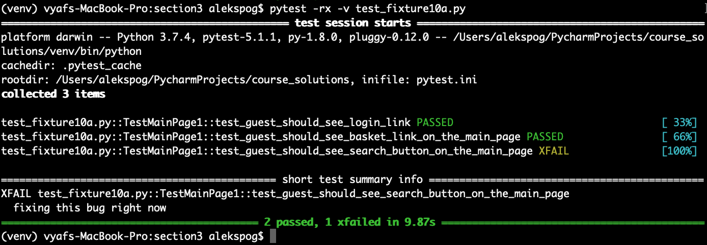
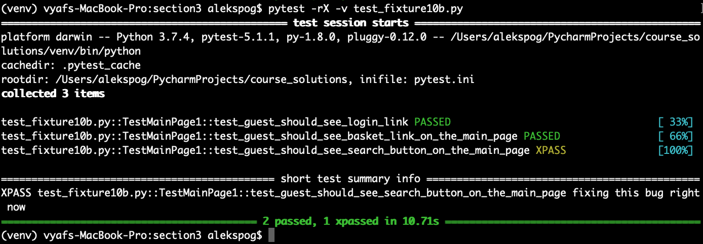

### Маркировка тестов часть 1
Когда тестов становится много, хорошо иметь способ разделять тесты не только по названиям, но также по каким-нибудь заданным нами категориям. Например, мы можем выбрать небольшое количество критичных тестов (smoke), которые нужно запускать на каждый коммит разработчиков, а остальные тесты обозначить как регрессионные (regression) и запускать их только перед релизом. Или у нас могут быть тесты, специфичные для конкретного браузера (internet explorer 11), и мы хотим запускать эти тесты только под данный браузер. Для выборочного запуска таких тестов в PyTest используется маркировка тестов или **метки (marks)**. Для маркировки теста нужно написать декоратор вида **@pytest.mark.mark_name**, где mark_name — произвольная строка.

Давайте разделим тесты в одном из предыдущих примеров на smoke и regression.

**test_fixture8.py:**
```python
import pytest
from selenium import webdriver

link = "http://selenium1py.pythonanywhere.com/"


@pytest.fixture(scope="function")
def browser():
    print("\nstart browser for test..")
    browser = webdriver.Chrome()
    yield browser
    print("\nquit browser..")
    browser.quit()


class TestMainPage1():

    @pytest.mark.smoke
    def test_guest_should_see_login_link(self, browser):
        browser.get(link)
        browser.find_element_by_css_selector("#login_link")

    @pytest.mark.regression
    def test_guest_should_see_basket_link_on_the_main_page(self, browser):
        browser.get(link)
        browser.find_element_by_css_selector(".basket-mini .btn-group > a")

```
Чтобы запустить тест с нужной маркировкой, нужно передать в командной строке параметр -m и нужную метку:

```
pytest -s -v -m smoke test_fixture8.py
```
Если всё сделано правильно, то должен запуститься только тест с маркировкой smoke.

При этом вы увидите warning, то есть предупреждение:

```
PytestUnknownMarkWarning: Unknown pytest.mark.smoke - is this a typo?  You can register custom marks to avoid this warning - for details, see https://docs.pytest.org/en/latest/mark.html
    PytestUnknownMarkWarning,
```
Это предупреждение появилось потому, что в последних версиях PyTest настоятельно рекомендуется регистрировать метки явно перед использованием. Это, например, позволяет избегать опечаток, когда вы можете ошибочно пометить ваш тест несуществующей меткой, и он будет пропускаться при прогоне тестов.

#### Как же регистрировать метки?
Создайте файл pytest.ini в корневой директории вашего тестового проекта и добавьте в файл следующие строки:

```
[pytest]
markers =
    smoke: marker for smoke tests
    regression: marker for regression tests
```
Текст после знака ":" является поясняющим — его можно не писать.

Снова запустите тесты:

```
pytest -s -v -m smoke test_fixture8.py
```
Теперь предупреждений быть не должно.

 

Так же можно маркировать целый тестовый класс. В этом случае маркировка будет применена ко всем тестовым методам, входящим в класс.


### Маркировка тестов часть 2
#### Инверсия
Чтобы запустить все тесты, не имеющие заданную маркировку, можно использовать инверсию. Для запуска всех тестов, не отмеченных как smoke, нужно выполнить команду:

```
pytest -s -v -m "not smoke" test_fixture8.py
```
#### Объединение тестов с разными маркировками
Для запуска тестов с разными метками можно использовать логическое ИЛИ. Запустим smoke и regression-тесты:

```
pytest -s -v -m "smoke or regression" test_fixture8.py
```
#### Выбор тестов, имеющих несколько маркировок
Предположим, у нас есть smoke-тесты, которые нужно запускать только для определенной операционной системы, например, для Windows 10. Зарегистрируем метку win10 в файле pytest.ini, а также добавим к одному из тестов эту метку.

**pytest.ini:**

```
[pytest]
markers =
    smoke: marker for smoke tests
    regression: marker for regression tests
    win10
```
**test_fixture81.py:**

```python
import pytest
from selenium import webdriver

link = "http://selenium1py.pythonanywhere.com/"


@pytest.fixture(scope="function")
def browser():
    print("\nstart browser for test..")
    browser = webdriver.Chrome()
    yield browser
    print("\nquit browser..")
    browser.quit()


class TestMainPage1:

    @pytest.mark.smoke
    def test_guest_should_see_login_link(self, browser):
        browser.get(link)
        browser.find_element_by_css_selector("#login_link")

    @pytest.mark.smoke
    @pytest.mark.win10
    def test_guest_should_see_basket_link_on_the_main_page(self, browser):
        browser.get(link)
        browser.find_element_by_css_selector(".basket-mini .btn-group > a")

```
Чтобы запустить только smoke-тесты для Windows 10, нужно использовать логическое И:

```
pytest -s -v -m "smoke and win10" test_fixture81.py
```
Должен выполнится тест test_guest_should_see_basket_link_on_the_main_page. 


### Пропуск тестов
В PyTest есть стандартные метки, которые позволяют пропустить тест при сборе тестов для запуска (то есть не запускать тест) или запустить, но отметить особенным статусом тот тест, который ожидаемо упадёт из-за наличия бага, чтобы он не влиял на результаты прогона всех тестов. Эти метки не требуют дополнительного объявления в pytest.ini.

#### Пропустить тест

Итак, чтобы пропустить тест, его отмечают в коде как **@pytest.mark.skip**:

```python
import pytest
from selenium import webdriver

link = "http://selenium1py.pythonanywhere.com/"

@pytest.fixture(scope="function")
def browser():
    print("\nstart browser for test..")
    browser = webdriver.Chrome()
    yield browser
    print("\nquit browser..")
    browser.quit()


class TestMainPage1():

    @pytest.mark.skip
    def test_guest_should_see_login_link(self, browser):
        browser.get(link)
        browser.find_element_by_css_selector("#login_link")

    def test_guest_should_see_basket_link_on_the_main_page(self, browser):
        browser.get(link)
        browser.find_element_by_css_selector(".basket-mini .btn-group > a")
```
В результатах теста мы увидим, что один тест был пропущен, а другой успешно прошёл: "**1 passed, 1 skipped**". 


### XFail: помечать тест как ожидаемо падающий
#### Отметить тест как падающий

Теперь добавим в наш тестовый класс тест, который проверяет наличие кнопки "Избранное":

```
def test_guest_should_see_search_button_on_the_main_page(self, browser): 
     browser.get(link)
     browser.find_element_by_css_selector("button.favorite")
```
Предположим, что такая кнопка должна быть, но из-за изменений в коде она пропала. Пока разработчики исправляют баг, мы хотим, чтобы результат прогона всех наших тестов был успешен, но падающий тест помечался соответствующим образом, чтобы про него не забыть. Добавим маркировку **@pytest.mark.xfail** для падающего теста.

**test_fixture10.py:**

```python
import pytest
from selenium import webdriver

link = "http://selenium1py.pythonanywhere.com/"


@pytest.fixture(scope="function")
def browser():
    print("\nstart browser for test..")
    browser = webdriver.Chrome()
    yield browser
    print("\nquit browser..")
    browser.quit()


class TestMainPage1():

    def test_guest_should_see_login_link(self, browser):
        browser.get(link)
        browser.find_element_by_css_selector("#login_link")

    def test_guest_should_see_basket_link_on_the_main_page(self, browser):
        browser.get(link)
        browser.find_element_by_css_selector(".basket-mini .btn-group > a")

    @pytest.mark.xfail
    def test_guest_should_see_search_button_on_the_main_page(self, browser):
        browser.get(link)
        browser.find_element_by_css_selector("button.favorite")

```
Запустим наши тесты:

```
pytest -v test_fixture10.py
```
Наш упавший тест теперь отмечен как **xfail**, но результат прогона тестов помечен как успешный:


Когда баг починят, мы это узнаем, **так как теперь тест будет отмечен как **XPASS** (“unexpectedly passing” — неожиданно проходит). После этого маркировку **xfail** для теста можно удалить. Кстати, к маркировке **xfail** можно добавлять параметр **reason**. Чтобы увидеть это сообщение в консоли, при запуске нужно добавлять параметр pytest **-rx**.

**test_fixture10a.py:**

```python
import pytest
from selenium import webdriver

link = "http://selenium1py.pythonanywhere.com/"


@pytest.fixture(scope="function")
def browser():
    print("\nstart browser for test..")
    browser = webdriver.Chrome()
    yield browser
    print("\nquit browser..")
    browser.quit()


class TestMainPage1():

    def test_guest_should_see_login_link(self, browser):
        browser.get(link)
        browser.find_element_by_css_selector("#login_link")

    def test_guest_should_see_basket_link_on_the_main_page(self, browser):
        browser.get(link)
        browser.find_element_by_css_selector(".basket-mini .btn-group > a")

    @pytest.mark.xfail(reason="fixing this bug right now")
    def test_guest_should_see_search_button_on_the_main_page(self, browser):
        browser.get(link)
        browser.find_element_by_css_selector("button.favorite")

```
Запустим наши тесты:
```
pytest -rx -v test_fixture10a.py
```

Сравните вывод в первом и во втором случае.



#### XPASS-тесты

Поменяем селектор в последнем тесте, чтобы тест начал проходить.

**test_fixture10b.py:**

```
import pytest
from selenium import webdriver

link = "http://selenium1py.pythonanywhere.com/"


@pytest.fixture(scope="function")
def browser():
    print("\nstart browser for test..")
    browser = webdriver.Chrome()
    yield browser
    print("\nquit browser..")
    browser.quit()


class TestMainPage1():

    def test_guest_should_see_login_link(self, browser):
        browser.get(link)
        browser.find_element_by_css_selector("#login_link")

    def test_guest_should_see_basket_link_on_the_main_page(self, browser):
        browser.get(link)
        browser.find_element_by_css_selector(".basket-mini .btn-group > a")

    @pytest.mark.xfail(reason="fixing this bug right now")
    def test_guest_should_see_search_button_on_the_main_page(self, browser):
        browser.get(link)
        browser.find_element_by_css_selector("input.btn.btn-default")

```
Запустите тесты. Здесь мы добавили символ X в параметр -r, чтобы получить подробную информацию по XPASS-тестам:

```
pytest -rX -v test_fixture10b.py
```
И изучите отчёт



Дополнительно об использовании этих меток можно почитать в документации: [Skip and xfail: dealing with tests that cannot succeed][1].  Там есть много разных интересных особенностей, например, как пропускать тест только при выполнении условия, как сделать так, чтобы внезапно прошедший xfailed тест в отчете стал красным, и так далее. 

[1]: https://pytest.org/en/stable/skipping.html