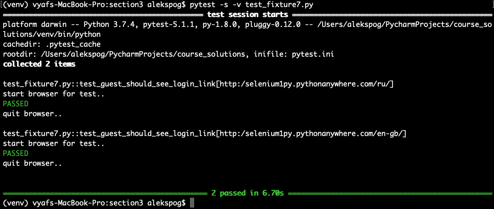

### Параметризация тестов
PyTest позволяет запустить один и тот же тест с разными входными параметрами. Для этого используется декоратор **@pytest.mark.parametrize()**. Наш сайт доступен для разных языков. Напишем тест, который проверит, что для сайта с русским и английским языком будет отображаться ссылка на форму логина. Передадим в наш тест ссылки на русскую и английскую версию главной страницы сайта.

В **@pytest.mark.parametrize()** нужно передать параметр, который должен изменяться, и список значений параметра. В самом тесте наш параметр тоже нужно передавать в качестве аргумента. Обратите внимание, что внутри декоратора имя параметра оборачивается в кавычки, а в списке аргументов теста кавычки не нужны.

**test_fixture7.py:**

```python
import pytest
from selenium import webdriver

@pytest.fixture(scope="function")
def browser():
    print("\nstart browser for test..")
    browser = webdriver.Chrome()
    yield browser
    print("\nquit browser..")
    browser.quit()

@pytest.mark.parametrize('language', ["ru", "en-gb"])
def test_guest_should_see_login_link(browser, language):
    link = f"http://selenium1py.pythonanywhere.com/{language}/"
    browser.get(link)
    browser.find_element_by_css_selector("#login_link")
```
Запустите тест:

```
pytest -s -v test_fixture7.py
```
Вы увидите, что запустятся два теста.  В названии каждого теста в квадратных скобках будет написан параметр, с которым он был запущен. Таким образом мы можем быстро и без дублирования кода увеличить количество проверок для похожих сценариев.



Можно задавать параметризацию также для всего тестового класса, чтобы все тесты в классе запустились с заданными параметрами. В таком случае отметка о параметризации должна быть перед объявлением класса: 

```python
@pytest.mark.parametrize('language', ["ru", "en-gb"])
class TestLogin:
    def test_guest_should_see_login_link(self, browser, language):
        link = f"http://selenium1py.pythonanywhere.com/{language}/"
        browser.get(link)
        browser.find_element_by_css_selector("#login_link")
        # этот тест запустится 2 раза

    def test_guest_should_see_navbar_element(self, browser, language):
        # этот тест тоже запустится дважды
```
Дополнительно, полезный туториал из документации: [Parametrizing fixtures and test functions][1]

[1]: https://docs.pytest.org/en/latest/how-to/parametrize.html?highlight=parametrize