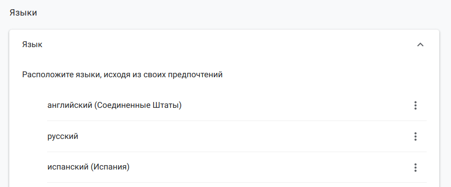

### Conftest.py — конфигурация тестов
Ранее мы добавили фикстуру browser, которая создает нам экземпляр браузера для тестов в данном файле. Когда файлов с тестами становится больше одного, приходится в каждом файле с тестами описывать данную фикстуру. Это очень неудобно. Для хранения часто употребимых фикстур и хранения глобальных настроек нужно использовать файл **conftest.py**, который должен лежать в директории верхнего уровня в вашем проекте с тестами. Можно создавать дополнительные файлы conftest.py в других директориях, но тогда настройки в этих файлах будут применяться только к тестам в под-директориях.

Создадим файл **conftest.py** в корневом каталоге нашего тестового проекта и перенесем туда фикстуру **browser**. Заметьте, насколько лаконичнее стал выглядеть файл с тестами.

**conftest.py:**

```python
import pytest
from selenium import webdriver

@pytest.fixture(scope="function")
def browser():
    print("\nstart browser for test..")
    browser = webdriver.Chrome()
    yield browser
    print("\nquit browser..")
    browser.quit()
```
Теперь, сколько бы файлов с тестами мы ни создали, у тестов будет доступ к фикстуре browser. Фикстура передается в тестовый метод в качестве аргумента. Таким образом можно удобно переиспользовать одни и те же вспомогательные функции в разных частях проекта.


**test_conftest.py:**

```
link = "http://selenium1py.pythonanywhere.com/"

def test_guest_should_see_login_link(browser):
    browser.get(link)
    browser.find_element_by_css_selector("#login_link")
```
##ОЧЕНЬ ВАЖНО! 
Есть одна важная особенность поведения конфигурационных файлов, о которой вы обязательно должны знать. PyTest автоматически находит и подгружает файлы conftest.py, которые находятся в директории с тестами. Если вы храните все свои скрипты для курса в одной директории, будьте аккуратны и следите, чтобы не возникало ситуации, когда вы запускаете тесты из папки tests:
```
tests/
├── conftest.py
├── subfolder
│   └── conftest.py
│   └── test_abs.py
следует избегать!
```
В таком случае применяется ОБА файла conftest.py, что может вести к непредсказуемым ошибкам и конфликтам.  

Таким образом можно переопределять разные фикстуры, но мы в рамках курса рекомендуем придерживаться одного файла на проект/задачу и держать их горизонтально, как-нибудь так: 

```
selenium_course_solutions/
├── section3
│   └── conftest.py
│   └── test_languages.py
├── section4 
│   └── conftest.py
│   └── test_main_page.py

правильно!
```
Будьте внимательны и следите, чтобы не было разных conftest во вложенных друг в друга директориях, особенно, когда будете скачивать и проверять задания сокурсников.

[Override a fixture on a folder (conftest) level][1]

[1]: https://docs.pytest.org/en/7.1.x/how-to/fixtures.html?highlight=fixture%20folder#override-a-fixture-on-a-folder-conftest-level


###Установка Firefox и Selenium-драйвера geckodriver
До этого момента мы запускали наши тесты только в браузере Chrome, но что делать, если нужно тестировать наше веб-приложение и в других браузерах? При этом мы будем запускать те же тесты, но при запуске тестов указывать, на каком браузере нужно запускать тесты. Возьмем в качестве второго браузера Firefox, так как он является вторым по популярности браузером, и его можно запустить на любой платформе. Запускать тесты мы хотим, указывая при запуске параметр browser_name, такой командой:

```
pytest -s -v --browser_name=firefox test_cmd.py
```
Сейчас нам придется вспомнить муки установки chromedriver из урока https://stepik.org/lesson/25969/ и повторить похожий сценарий установки браузера Firefox и Selenium-драйвера для него.

Для установки Firefox скачайте его с официального сайта и установите в вашей ОС: https://www.mozilla.org/firefox/new/.

Selenium-драйвер для Firefox носит название geckodriver. Скачайте последнюю версию geckodriver с сайта https://github.com/mozilla/geckodriver/releases и распакуйте его в папку C:\geckodriver на Windows, /usr/local/bin на Ubuntu и macOS. Для более подробной инструкции по установке geckodriver смотрите https://selenium-python.com/install-geckodriver. Для Windows не забудьте добавить в системную переменную PATH папку C:\geckodriver и перезапустить командную строку, чтобы путь стал доступен.

Чтобы проверить правильность установки geckodriver, выполните в интерпретаторе Python команды:

```python
from selenium import webdriver

# инициализируем драйвер браузера. После этой команды вы должны увидеть новое открытое окно браузера
driver = webdriver.Firefox()

driver.get("https://stepik.org/lesson/25969/step/8")

```
Если вы увидели, как запустилось новое окно браузера Firefox и открылась указанная ссылка, то можете переходить к следующему шагу.

Если при попытке выполнения кода вы увидели подобное сообщение:

```
selenium.common.exceptions.WebDriverException: Message: 'geckodriver' executable needs to be in PATH. 
```
значит, geckodriver не установлен или к нему не прописан путь в системе. Повторите заново действия по установке. Если Firefox всё равно не запускается, то напишите в комментариях последовательность ваших действий и подробный лог ошибки, чтобы мы могли вам помочь.


### Conftest.py и передача параметров в командной строке
Встроенная фикстура **request** может получать данные о текущем запущенном тесте, что позволяет, например, сохранять дополнительные данные в отчёт, а также делать многие другие интересные вещи. В этом шаге мы хотим показать, как можно настраивать тестовые окружения с помощью передачи параметров через командную строку.

Это делается с помощью встроенной функции pytest_addoption и фикстуры request. Сначала добавляем в файле conftest обработчик опции в функции pytest_addoption, затем напишем фикстуру, которая будет обрабатывать переданные в опции данные. Подробнее можно ознакомиться здесь: https://docs.pytest.org/en/latest/example/simple.html?highlight=addoption

Добавим логику обработки командной строки в conftest.py. Для запроса значения параметра мы можем вызвать команду:

```python
browser_name = request.config.getoption("browser_name")
```
**conftest.py:**

```python

import pytest
from selenium import webdriver

def pytest_addoption(parser):
    parser.addoption('--browser_name', action='store', default=None,
                     help="Choose browser: chrome or firefox")


@pytest.fixture(scope="function")
def browser(request):
    browser_name = request.config.getoption("browser_name")
    browser = None
    if browser_name == "chrome":
        print("\nstart chrome browser for test..")
        browser = webdriver.Chrome()
    elif browser_name == "firefox":
        print("\nstart firefox browser for test..")
        browser = webdriver.Firefox()
    else:
        raise pytest.UsageError("--browser_name should be chrome or firefox")
    yield browser
    print("\nquit browser..")
    browser.quit()

```
**test_parser.py:**

```python
link = "http://selenium1py.pythonanywhere.com/"


def test_guest_should_see_login_link(browser):
    browser.get(link)
    browser.find_element_by_css_selector("#login_link")
```
Если вы теперь запустите тесты без параметра, то получите ошибку:

```
pytest -s -v test_parser.py
```
```
_pytest.config.UsageError: --browser_name should be chrome or firefox
```
Можно задать значение параметра по умолчанию, чтобы в командной строке не обязательно было указывать параметр *--browser_name*, например, так:

```
parser.addoption('--browser_name', action='store', default="chrome",
                 help="Choose browser: chrome or firefox")
```
Давайте укажем параметр:

```
pytest -s -v --browser_name=chrome test_parser.py
```
А теперь запустим тесты на Firefox:

```
pytest -s -v --browser_name=firefox test_parser.py
```
Вы должны увидеть, как сначала тесты запустятся в браузере Chrome, а затем — в Firefox.


### Плагины и перезапуск тестов
Для PyTest написано большое количество [плагинов][1], то есть дополнительных модулей, которые расширяют возможности этого фреймворка. Полный список доступных плагинов доступен [здесь][2].

[1]: https://docs.pytest.org/en/latest/explanation/flaky.html?highlight=plugins#plugins
[2]: https://docs.pytest.org/en/latest/reference/plugin_list.html

Рассмотрим еще одну проблему, с которой вы обязательно столкнетесь, когда будете писать end-to-end тесты на Selenium. Flaky-тесты или "мигающие" авто-тесты, т.е. такие тесты, которые по независящим от нас внешним обстоятельствам или из-за трудновоспроизводимых багов, могут иногда падать, хотя всё остальное время они проходят успешно. Это может происходить в момент прохождения тестов из-за одновременного обновления сайта, из-за сетевых проблем или странных стечений обстоятельств. Конечно, надо стараться исключать такие проблемы и искать причины возникновения багов, но в реальном мире бывает, что это требует слишком много усилий. Поэтому мы будем перезапускать упавший тест, чтобы еще раз убедиться, что он действительно нашел баг, а не упал случайно.

Это сделать очень просто. Для этого мы будем использовать плагин **pytest-rerunfailures**.

Сначала установим плагин в нашем виртуальном окружении. После установки плагин будет автоматически найден PyTest, и можно будет пользоваться его функциональностью без дополнительных изменений кода:

```
pip install pytest-rerunfailures
```
Чтобы указать количество перезапусков для каждого из упавших тестов, нужно добавить в командную строку параметр:

"**--reruns n**", где n — это количество перезапусков. Если при повторных запусках тесты пройдут успешно, то и прогон тестов будет считаться успешным. Количество перезапусков отображается в отчёте, благодаря чему можно позже анализировать проблемные тесты.
Дополнительно мы указали параметр "**--tb=line**", чтобы сократить лог с результатами теста. Можете почитать подробнее про настройку вывода в документации [PyTest][3]:

[3]: https://docs.pytest.org/en/stable/usage.html#modifying-python-traceback-printing

```
pytest -v --tb=line --reruns 1 --browser_name=chrome test_rerun.py
```
Давайте напишем два теста: один из них будет проходить, а другой — нет. Посмотрим, как выглядит перезапуск.

**test_rerun.py:**

```python
link = "http://selenium1py.pythonanywhere.com/"

def test_guest_should_see_login_link_pass(browser):
    browser.get(link)
    browser.find_element_by_css_selector("#login_link")

def test_guest_should_see_login_link_fail(browser):
    browser.get(link)
    browser.find_element_by_css_selector("#magic_link")
```
Мы увидим сообщение: "1 failed, 1 passed, 1 rerun in 9.20s", то есть упавший тест был перезапущен, но при втором запуске тоже упал. Если бы во второй раз мигающий тест все-таки прошёл успешно, то мы бы увидели сообщение: "2 passed, 1 rerun in 9.20s", и итоговый результат запуска всех тестов считался бы успешным.


### Запуск автотестов для разных языков интерфейса
Цель: научиться запускать автотесты для разных локалей, т.е. для разных языков интерфейсов.

Мы уже запускали автотесты для разных языков в одном из предыдущих [шагов][1], используя параметризацию с помощью разных ссылок, но такой подход сложно масштабировать на большое количество тестов. Давайте сделаем так, чтобы сервер сам решал, какой язык интерфейса нужно отобразить, основываясь на данных браузера. Браузер передает данные о языке пользователя через запросы к серверу, указывая в Headers (заголовке запроса) параметр **accept-language**. Если сервер получит запрос с заголовком {accept-language: ru, en}, то он отобразит пользователю русскоязычный интерфейс сайта. Если русский язык не поддерживается, то будет показан следующий язык из списка, в данном случае пользователь увидит англоязычный интерфейс. Это, кстати, примерно то же самое, что и выставить предпочтительный язык в настройках своего браузера: 

[1]: https://stepik.org/lesson/237240/step/2



Чтобы указать язык браузера с помощью WebDriver, используйте класс **Options** и метод **add_experimental_option**, как указано в примере ниже:

```python
from selenium.webdriver.chrome.options import Options

options = Options()
options.add_experimental_option('prefs', {'intl.accept_languages': user_language})
browser = webdriver.Chrome(options=options)
```
Для Firefox объявление нужного языка будет выглядеть немного иначе:

```python
fp = webdriver.FirefoxProfile()
fp.set_preference("intl.accept_languages", user_language)
browser = webdriver.Firefox(firefox_profile=fp)
```
*В конструктор webdriver.Chrome или webdriver.Firefox вы можете добавлять разные аргументы, расширяя возможности тестирования ваших веб-приложений: можно указывать прокси-сервер для контроля сетевого трафика или запускать разные версии браузера, указывая локальный путь к файлу браузера. Предполагаем, что эти возможности вам понадобятся позже и вы сами сможете найти настройки для этих задач.*