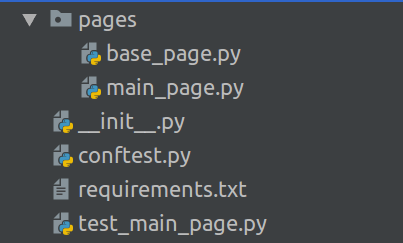

### Page Object для главной страницы сайта
Теперь реализуем Page Object, который будет связан с главной страницей интернет-магазина. 

1. Откройте файл ```main_page.py``` 

2. В нем нужно сделать импорт базового класса BasePage: 

```python
from .base_page import BasePage
```
3. В нем создайте класс  ```MainPage```. Его нужно сделать наследником класса ```BasePage```. Класс-предок в Python указывается в скобках: 

```python
class MainPage(BasePage): 
```
таким образом, класс MainPage будет иметь доступ ко всем атрибутам и методам своего класса-предка. 

4. Перенесите метод из предыдущего урока в класс ```MainPage```:

```python
def go_to_login_page(browser):
   login_link = browser.find_element_by_css_selector("#login_link")
   login_link.click() 
```
Чтобы все работало, надо слегка видоизменить его. В аргументы больше не надо передавать экземпляр браузера, мы его передаем и сохраняем на этапе создания Page Object. Вместо него нужно указать аргумент self , чтобы иметь доступ к атрибутам и методам класса: 
```python
def go_to_login_page(self):
```
Так как браузер у нас хранится как аргумент класса ```BasePage```, обращаться к нему нужно соответствующим образом с помощью ```self```: 

```python
self.browser.find_element_by_css_selector("#login_link")
```
Заодно заменим find на более универсальный: 

```python
self.browser.find_element(By.CSS_SELECTOR, "#login_link")
```
Итого, файл *main_page.py*: 
```python
from .base_page import BasePage
from selenium.webdriver.common.by import By

class MainPage(BasePage): 
    def go_to_login_page(self):
        login_link = self.browser.find_element(By.CSS_SELECTOR, "#login_link")
        login_link.click()
```


### Первый тест на основе Page Object
Ура, первый прототип страницы мы уже реализовали! Давайте теперь перепишем тест с помощью Page Object: 

1. Откройте файл с вашим тестом test_main_page.py

2. В самом верху файла нужно импортировать класс, описывающий главную страницу: 

```python
from .pages.main_page import MainPage
```
3. Теперь преобразуем сам тест в *test_main_page.py*: 

```python
from .pages.main_page import MainPage


def test_guest_can_go_to_login_page(browser):
    link = "http://selenium1py.pythonanywhere.com/"
    page = MainPage(browser, link)   # инициализируем Page Object, передаем в конструктор экземпляр драйвера и url адрес 
    page.open()                      # открываем страницу
    page.go_to_login_page()          # выполняем метод страницы — переходим на страницу логина
```
4. Убедитесь, что тест проходит, запустив его все той же командой: 

```pytest -v --tb=line --language=en test_main_page.py```

