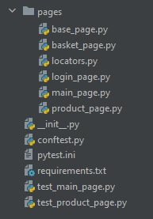

### Задание: группировка тестов и setup
**ВАЖНО!** Вообще говоря манипулировать браузером в сетапе и уж тем более что-то там проверять — это плохая практика, лучше так не делать без особой необходимости. Здесь этот пример исключительно в учебных целях, чтобы вы попробовали писать сетапы для тестов. В реальной жизни мы реализовали бы все эти манипуляции с помощью API или напрямую через базу данных.

В этом задании мы хотим добавить тестовые сценарии не только для гостей сайта, но и для зарегистрированных пользователей. Для этого:

1. В файле *test_product_page.py* добавьте новый класс для тестов **TestUserAddToBasketFromProductPage**.
2. Добавьте туда уже написанные тесты **test_guest_cant_see_success_message** и **test_guest_can_add_product_to_basket** и переименуйте, заменив **guest** на **user**. Шаги тестов не изменятся, добавится лишь регистрация перед тестами. Параметризация здесь уже не нужна, не добавляйте её. 
3. Добавьте в **LoginPage** метод **register_new_user(email, password)**, который принимает две строки и регистрирует пользователя. Реализуйте его, описав соответствующие элементы страницы.
4. Добавьте в **BasePage** проверку того, что пользователь залогинен:
```python
def should_be_authorized_user(self):
    assert self.is_element_present(*BasePageLocators.USER_ICON), "User icon is not presented," \
                                                                 " probably unauthorised user"
```
5. Селектор соответственно в **BasePageLocators**:

```USER_ICON = (By.CSS_SELECTOR, ".icon-user")```

6. Добавьте в класс фикстуру setup. В этой функции нужно:
- открыть страницу регистрации;
- зарегистрировать нового пользователя;
- проверить, что пользователь залогинен.
7. Запустите оба теста и убедитесь, что они проходят и действительно регистрируют новых пользователей
8. Зафиксируйте изменения в репозитории коммитом с осмысленным сообщением 

**Примечание**: 

**yield** писать не нужно — пользователей удалять мы не умеем. Генерировать email адреса для пользователей можно по-разному, один из вариантов, чтобы избежать повторения, использовать текущее время с помощью модуля time:
```python
import time # в начале файла

email = str(time.time()) + "@fakemail.org"
```


## Финишная прямая: готовим код к ревью
Поздравляем, вы уже почти закончили свой финальный проект! В следующем шаге вы отправите его на оценку сокурсникам, а сейчас время немного причесать его и довести до совершенства. Следуйте этим советам, чтобы получить максимальные  баллы:

1. Убедитесь, что в репозитории есть все нужные файлы. Все файлы, где хранятся страницы, лежат в отдельной папке pages. В итоге структура файлов и папок должна выглядеть так:



Убедитесь, что ничего не потерялось. Обратите внимание обязательно на conftest.py. 

2. Проверьте **requirements.txt** и убедитесь что там указаны нужные версии пакетов, как минимум: 

pytest==5.1.1
selenium==3.14.0
Желательно, чтобы там еще не было лишнего. Помните, что задание будут проверять ваши сокурсники, и им вряд ли понравится ставить огромную кучу пакетов. 

3. Проверьте, что все тесты, описанные в *test_main_page.py* и *test_product_page.py* запускаются и проходят (очевидно, за исключением тех, которые помечены как **xfail/skip**). 

4. Проверьте стиль кода. Представьте, что ваш код будет читать человек, который никогда не программировал и не автоматизировал тестирование — ему должно быть понятно, что происходит. 

Убедитесь что все переменные, методы и классы, которые вы создаете, называются осмысленно. 

Удалите весь ненужный закомментированный код, помним, что захламлять репозиторий лишним — плохой тон. 

5. Откройте *test_product_page.py*. Убедитесь, что там есть следующие тесты: 

```test_user_can_add_product_to_basket```

```test_guest_can_add_product_to_basket```

```test_guest_cant_see_product_in_basket_opened_from_product_page```

```test_guest_can_go_to_login_page_from_product_page```

Отмаркируйте эти тесты меткой:

```@pytest.mark.need_review```

Не забудьте зарегистрировать метку, чтобы избежать предупреждений: [Как же регистрировать метки?][111]

[111]: https://stepik.org/lesson/236918/step/2?unit=209305

Убедитесь, что при запуске с помощью следующей команды тесты запускаются и успешно проходят: 

```pytest -v --tb=line --language=en -m need_review```
6. Убедитесь, что все тесты написаны в стиле PageObject: нет **assert** в теле тестов, все методы действия и проверки выделены в отдельные методы в классах PageObject, все селекторы лежат в **locators.py**.

7. Зафиксируйте все изменения коммитом. Не добавляйте локальные файлы окружения, файлы ide и прочие вспомогательные вещи в отслеживаемые. Нужен только код!

8. Сделайте пуш изменений в свой репозиторий.

9. Откройте репозиторий на GitHub и перепроверьте пункты 1, 2, 4, 5 и 6.

10. Порадуйтесь за себя и переходите к следующему шагу.