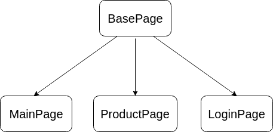
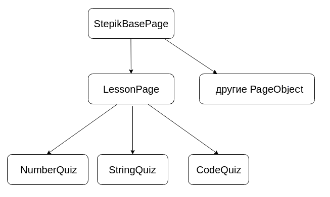

### Плюсы наследования: магия ООП
Если вы использовали ранее парадигму ООП при написании кода, то уже представляете, как хорошая архитектура может облегчить жизнь. В этом плане код автотестов ничем не отличается от кода приложений — мы можем использовать всё те же приёмы для организации методов.

Здесь мы рассмотрим лишь один из примеров: использование механизма наследования.

Мы уже немного использовали механизм наследования, когда сделали базовый класс для всех наших проверок BasePage, а от него наследовали все остальные Page Object: LoginPage, MainPage. Сейчас у нас в классе BasePage в основном технические детали — реализация поиска элементов, метод для открытия страницы и прохождения капчи. Но никто не мешает нам добавить туда элементы и методы, которые являются общими для всех страниц.


 
**ВАЖНО!** Не нужно запихивать в базовый класс все, что плохо лежит и может когда-нибудь пригодиться. Добавлять нужно только то, что ОБЯЗАТЕЛЬНО будет на каждой странице-наследнике, иначе есть риск, что увеличение строк кода в файле будет неконтролируемым, и поддерживать его будет сложно.

Вообще говоря, мы можем строить какую угодно иерархию наших классов для взаимодействия с веб-приложением, если это поможет избежать дублирования кода. Например, есть набор страниц с общими методами, мы можем организовать их в виде наследования с дополнительным "слоем".

Например, когда мы тестируем страницу урока в Stepik (это та страница, на которой вы сейчас находитесь), мы используем LessonPage как базовый класс, где содержатся общие элементы и методы для всех типов шагов (шапка, комментарии, боковое расписание) и класс-наследник для каждого типа заданий, а их на Stepik более 20, каждый со своими уникальными методами и элементами. Такой подход позволяет избежать дублирования кода, и необходимости поддерживать файл на >1000 строк кода. 




### Плюсы наследования: пример
В предыдущем уроке, мы написали тест "гость может перейти на страницу логина с главной страницы магазина". Но если вы внимательно посмотрите на остальные страницы, то заметите, что ссылка на страницу логина присутствует на каждой странице. Если мы хотим добавить тест "гость может перейти на страницу логина со страницы товара", то для избежания дублирования, логично перенести соответствующие методы в класс **BasePage**. Давайте так и поступим: 

В файле *locators.py* создаем новый класс **BasePageLocators** и переносим туда соответствующие элементы:

```python
class BasePageLocators():
    LOGIN_LINK = (By.CSS_SELECTOR, "#login_link")
    LOGIN_LINK_INVALID = (By.CSS_SELECTOR, "#login_link_inc")
```
В файл *base_page.py* переносим соответствующие методы, заменяя класс с локаторами на BasePageLocators:  

```python
from .locators import BasePageLocators


class BasePage():
...
    def go_to_login_page(self):
        link = self.browser.find_element(*BasePageLocators.LOGIN_LINK_INVALID)
        link.click()

    def should_be_login_link(self):
        assert self.is_element_present(*BasePageLocators.LOGIN_LINK), "Login link is not presented"
... 
```
**Примечание**: *методы лучше всего описывать в классе в алфавитном порядке, так проще ориентироваться и находить*.

В классе **MainPage** у нас не осталось никаких методов, поэтому добавим туда заглушку: 

```python
class MainPage(BasePage):
    def __init__(self, *args, **kwargs):
        super(MainPage, self).__init__(*args, **kwargs)
```
Как вы уже знаете, метод **\__init\__** вызывается при создании объекта. Конструктор выше с ключевым словом **super** на самом деле только вызывает конструктор класса предка и передает ему все те аргументы, которые мы передали в конструктор **MainPage**. 

Теперь мы можем легко добавлять тесты вида "гость может перейти на страницу логина со страницы Х". 

Добавляем в файл c тестами *test_product_page.py* новые тесты: 

```python
def test_guest_should_see_login_link_on_product_page(browser):
    link = "http://selenium1py.pythonanywhere.com/en-gb/catalogue/the-city-and-the-stars_95/"
    page = ProductPage(browser, link)
    page.open()
    page.should_be_login_link()
```
Добавьте самостоятельно второй тест 

**test_guest_can_go_to_login_page_from_product_page** 

Запустите тесты и убедитесь, что они проходят. 

Зафиксируйте изменения коммитом. 